# Welcome to Lokal.in
# Aplikasi Lokal.in Dengan React Native (Expo) & Backend | Database	Supabase (PostgreSQL) 
Lokal.in adalah platform mobile berbasis Android/iOS yang bertujuan untuk mendigitalisasi sektor UMKM (Usaha Mikro, Kecil, dan Menengah). Aplikasi ini memudahkan masyarakat untuk menemukan produk lokal terbaik di sekitar mereka dan membantu pelaku UMKM meningkatkan visibilitas bisnis mereka di era digital.

## Instalasi

1. **Clone repository ini**
   ```bash
   git clone https://github.com/Ahmadsanusi18/Lokal.in.git
   cd Lokal.in
   ```

2. **Install dependencies**
   ```bash
   npm install
   ```
   atau
   ```bash
   yarn install
   ```

## ▶️ Cara Menjalankan

### Development Mode

1. **Jalankan development server**
   ```bash
   npm start
   ```
   atau
   ```bash
   yarn start
   ```

2. **Pilih platform yang ingin digunakan:**
   - Tekan `a` untuk Android
   - Tekan `i` untuk iOS (hanya macOS)
   - Tekan `w` untuk Web
   - Scan QR code dengan Expo Go app di smartphone Anda

### Build untuk Production

#### Android
```bash
npm run android
```

#### iOS (hanya macOS)
```bash
npm run ios
```

#### Web
```bash
npm run web
```

## 📸 Screenshot Aplikasi

**Tampilan Aplikasi Lokal.in:**
**Login & Register**
| Login | Register |
|-----------|------------|
| 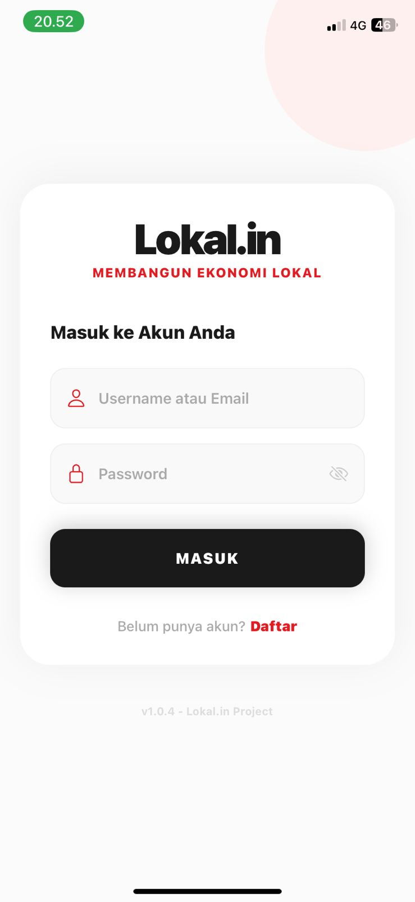 | 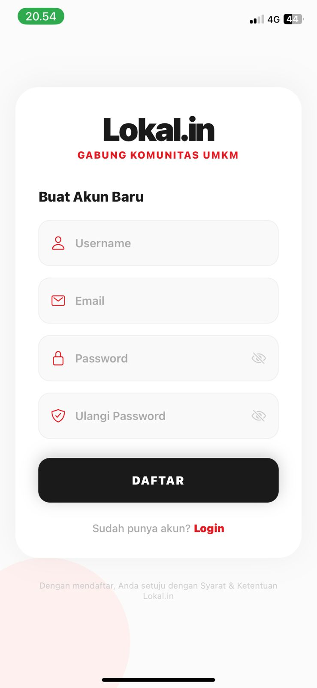 | 

**Index**
| Admin | Seller | Buyer |
|-----------|------------|------------|
| 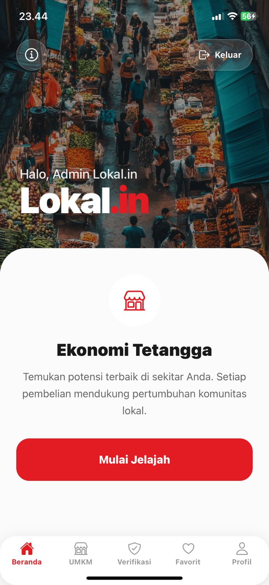 | 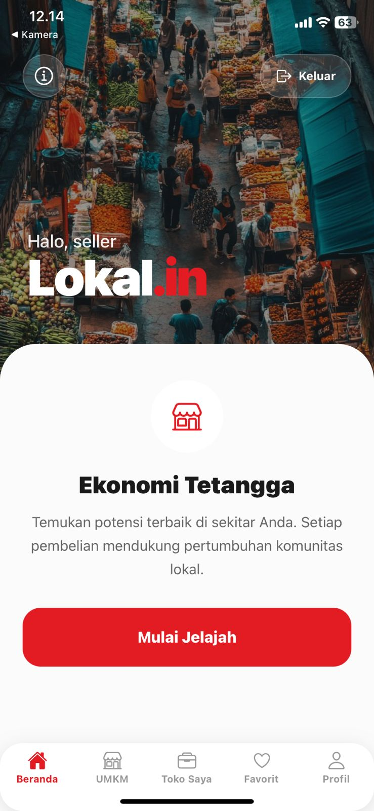 | 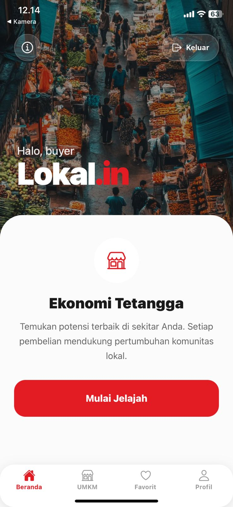 |

**Profil**
| Admin | Seller | Buyer |
|-----------|------------|------------|
| 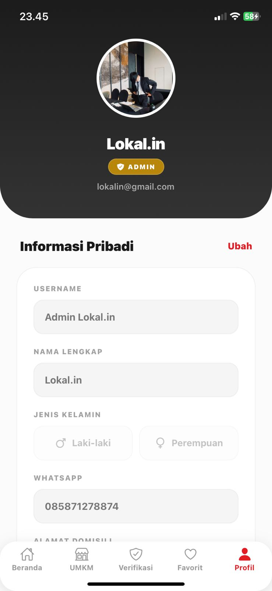 | 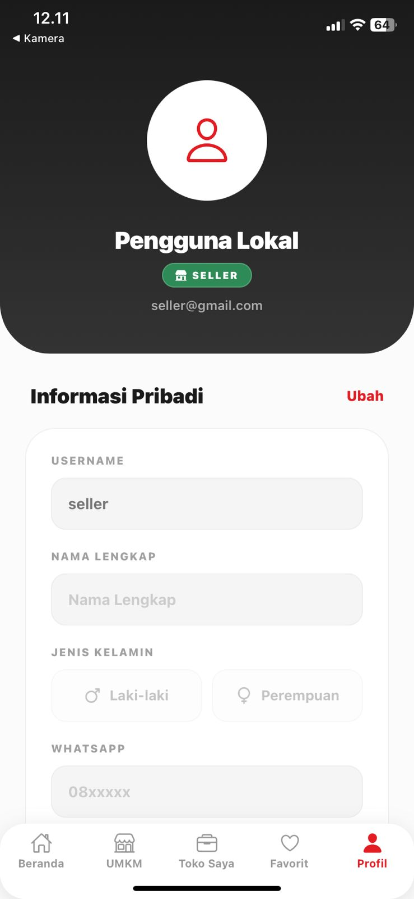 | 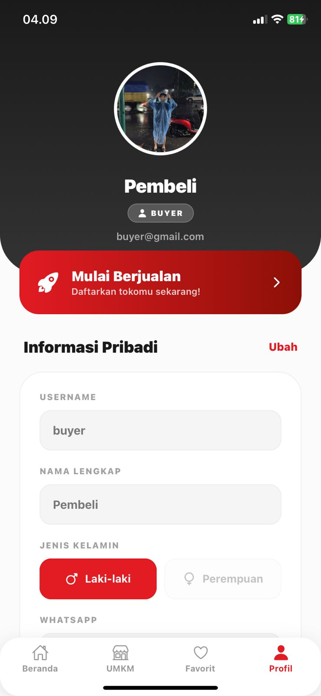 |

**Akses Buyer/Pembeli**
| UMKM | Detail| Ulasan | Favorit | Daftar to Seller |
|-----------|------------|------------|------------|------------|
|  | 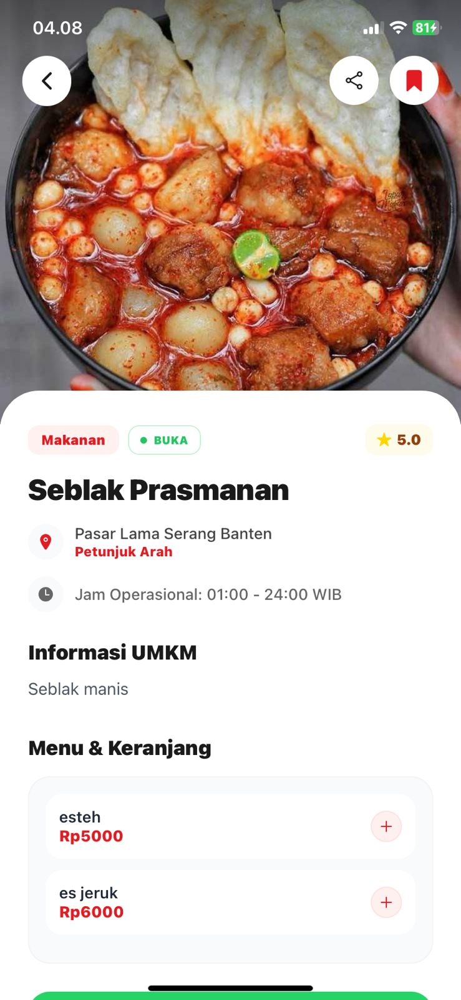 | 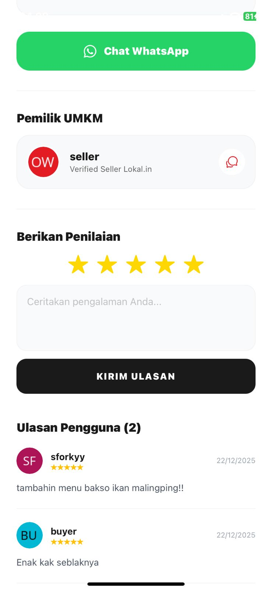 | 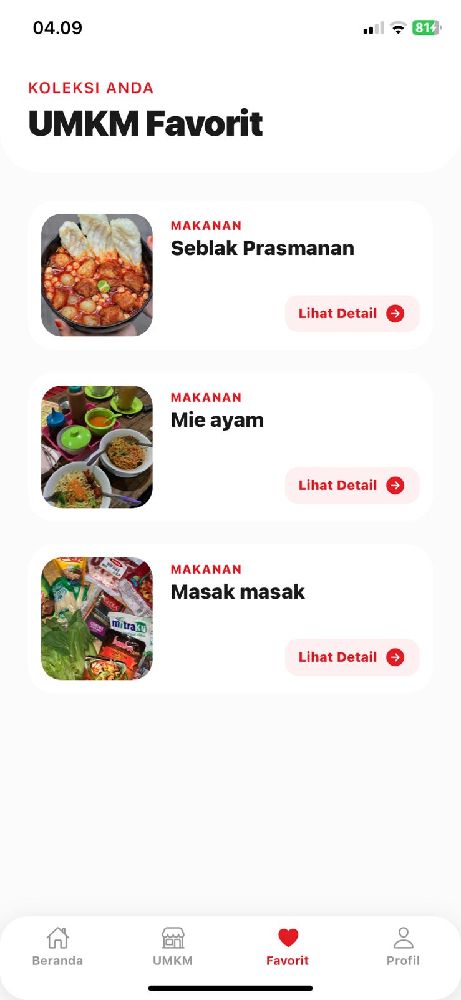 | 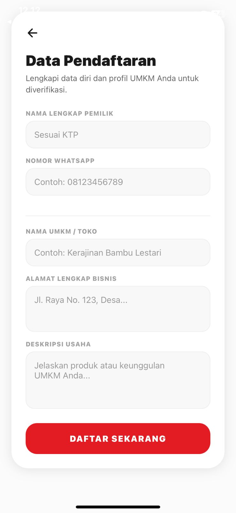 |

**Akses Seller/Penjual**
| Toko | Edit |
|-----------|------------|
| 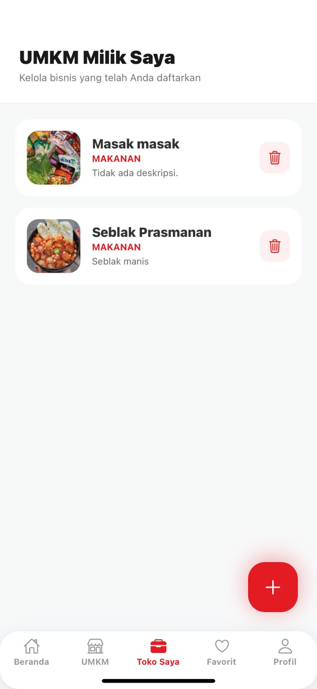 | 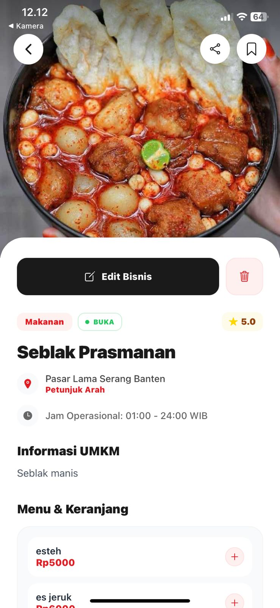 | 

**Akses Admin**
| Verifikasi | 
|-----------|
| 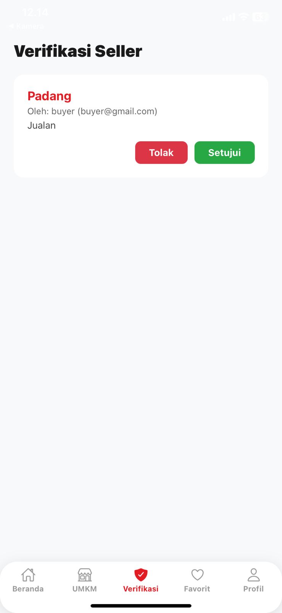 | 

## Fitur Utama
- 📍 **Pencarian UMKM Berbasis Lokasi**: Menemukan tempat usaha terdekat lengkap dengan alamat dan petunjuk arah (Google Maps).
- 🕒 **Status Operasional Real-Time**: Mengetahui apakah toko sedang BUKA atau TUTUP secara otomatis berdasarkan jam operasional.
- 🛒 **Keranjang Pesanan via WhatsApp**: Fitur pemesanan produk langsung melalui WhatsApp dengan rincian item dan total harga otomatis.
- ⭐ **Sistem Ulasan & Rating**: Pengguna dapat memberikan penilaian dan testimoni untuk membangun reputasi UMKM.
- 📑 **Manajemen Bisnis (Admin/Owner)**: Pelaku usaha dapat menambah, mengedit, atau menghapus informasi bisnis mereka sendiri.
- 🔖 **Bookmark & Favorit**: Simpan daftar UMKM favorit untuk diakses dengan cepat di lain waktu.
- 📢 **Share ke Media Sosial**: Bagikan profil UMKM favorit ke teman-teman melalui fitur berbagi sistem.

# Menggunakan Beberapa Role
- **Buyer** : Sebagai akun Pembeli yang hanya bisa memesan, menambahkan produk UMKM ke favorit dan edit akun, tetapi bisa juga menjadi Seller dengan syarat mngeajukan menjadi seller dibagian profil
- **Seller** : Sebagai pemilik/penjual UMKM yang bisa menambahkan produk UMKM, Mengedit UMKMnya sendiri, serta hapus UMKM
- **Admin** : Sebagai Pengendali Utama Aplikasi Lokal.in, yang bisa mengedit dan menghapus serta memverifikasi user yang mengajukan untuk menjadi Seller

## 📁 Struktur Proyek

```
app/
├── (tabs)/                 # Grup rute utama menggunakan navigasi tab bawah
│   ├── _layout.tsx         # Konfigurasi navigasi tab (ikon, label, dan warna)
│   ├── admin_panel.tsx     # Dashboard khusus untuk admin mengelola sistem
│   ├── explore.tsx         # Fitur pencarian dan eksplorasi UMKM secara luas
│   ├── favorites.tsx       # Daftar UMKM yang disimpan/difavoritkan oleh pengguna
│   ├── index.tsx           # Halaman Beranda (Landing Page) aplikasi
│   ├── info.tsx            # Halaman informasi aplikasi / bantuan
│   ├── manage_shop.tsx     # Dashboard khusus pemilik toko untuk mengelola produk
│   ├── profile.tsx         # Pengaturan akun pengguna dan informasi profil
│   └── umkm.tsx            # Daftar list UMKM yang terdaftar di platform
│
├── _layout.tsx             # Root layout utama (Provider Autentikasi & Stack Navigation)
├── add-business.tsx        # Formulir pendaftaran UMKM baru ke sistem
├── apply-seller.tsx        # Halaman pengajuan verifikasi menjadi penjual (Seller Application)
├── details.tsx             # Halaman detail mendalam untuk satu UMKM (Deskripsi, Menu, WA)
├── login.tsx               # Antarmuka masuk pengguna menggunakan Supabase Auth
├── modal.tsx               # Komponen modal global untuk interaksi cepat
└── register.tsx            # Antarmuka pendaftaran akun pengguna baru
```

## 👤 Author

**Ahmad Sanusi**
- GitHub: [@Ahmadsanusi18](https://github.com/Ahmadsanusi18)
- Repository: [Lokal.in](https://github.com/Ahmadsanusi18/Lokal.in.git)
- Instagram: [@a.saan_](https://www.instagram.com/a.saan_)

⭐ Jika Anda menyukai proyek ini, jangan lupa berikan star di GitHub!
